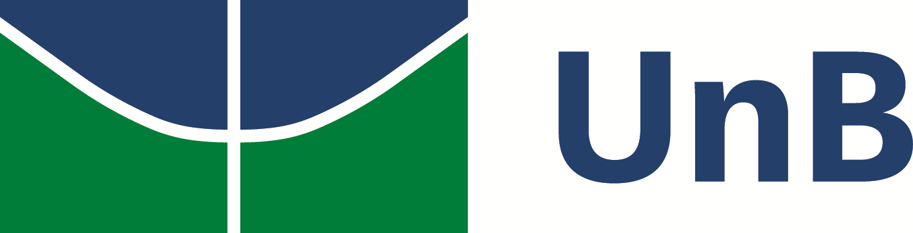
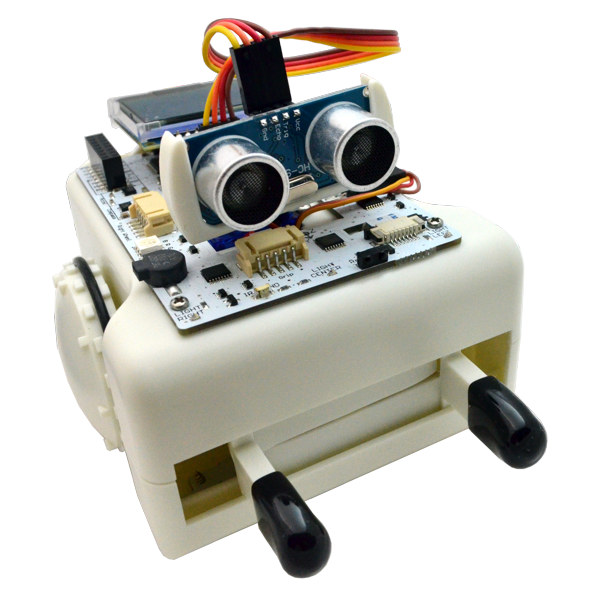

# Projeto Edubot

## Sobre o Projeto

**Edubot** é uma iniciativa da **Universidade de Brasília (UnB)**, vinculada ao capítulo estudantil da **Robotics and Automation Society (RAS)** do IEEE. O projeto tem como objetivo promover o ensino de **robótica educacional** em escolas públicas do **Distrito Federal**, proporcionando aos estudantes o primeiro contato com conceitos de ciência, tecnologia, engenharia e matemática (STEM).

## Robô Utilizado

O robô escolhido para as atividades é o **Sparki**, desenvolvido pela ArcBotics. Ele é um robô educativo acessível e repleto de sensores e atuadores que permitem uma grande variedade de experimentos e desafios didáticos.

- **Sensores**: ultrassônico, infravermelho, acelerômetro, bússola, entre outros
- **Atuadores**: motores de rodas, servo motor para caneta, buzzer, LEDs RGB

## Linguagem de Programação

As programações do Sparki são realizadas utilizando o **SparkiDuino**, uma linguagem própria baseada em **C**, criada pela ArcBotics. O SparkiDuino combina a simplicidade do Arduino com funções específicas para facilitar a programação do robô Sparki, sendo ideal para o aprendizado introdutório em robótica e lógica de programação.

## Objetivos do Edubot

- Democratizar o acesso à educação tecnológica.
- Desenvolver habilidades de resolução de problemas e pensamento lógico.
- Estimular o interesse por carreiras em ciência e engenharia.
- Oferecer experiências práticas em programação e robótica.

## Público-Alvo

Estudantes de escolas públicas do Distrito Federal, do ensino fundamental II ao ensino médio, priorizando turmas que ainda não tiveram contato prévio com robótica educacional.

## Apoio Institucional

- Universidade de Brasília (UnB)
- IEEE Robotics and Automation Society (RAS) - Capítulo Estudantil UnB

## Licença

Este projeto é disponibilizado sob a licença [MIT](LICENSE).

---

**Vamos juntos transformar a educação com tecnologia! 🚀🤖**
